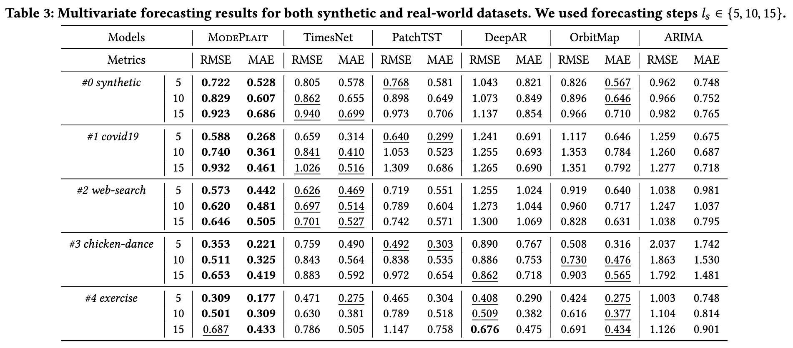

# ModePlait: Modeling Time-Evolving Causality over Data Streams

[](https://www.python.org/downloads/release/python-3915/)
[](https://python-poetry.org/)
[](https://opensource.org/licenses/MIT)
[](https://arxiv.org/abs/2502.08963)
[](https://doi.org/10.1145/3690624.3709283)
[![DeepWiki](https://img.shields.io/badge/DeepWiki-C--Naoki%2FModePlait-blue.svg?logo=data:image/png;base64,iVBORw0KGgoAAAANSUhEUgAAACwAAAAyCAYAAAAnWDnqAAAAAXNSR0IArs4c6QAAA05JREFUaEPtmUtyEzEQhtWTQyQLHNak2AB7ZnyXZMEjXMGeK/AIi+QuHrMnbChYY7MIh8g01fJoopFb0uhhEqqcbWTp06/uv1saEDv4O3n3dV60RfP947Mm9/SQc0ICFQgzfc4CYZoTPAswgSJCCUJUnAAoRHOAUOcATwbmVLWdGoH//PB8mnKqScAhsD0kYP3j/Yt5LPQe2KvcXmGvRHcDnpxfL2zOYJ1mFwrryWTz0advv1Ut4CJgf5uhDuDj5eUcAUoahrdY/56ebRWeraTjMt/00Sh3UDtjgHtQNHwcRGOC98BJEAEymycmYcWwOprTgcB6VZ5JK5TAJ+fXGLBm3FDAmn6oPPjR4rKCAoJCal2eAiQp2x0vxTPB3ALO2CRkwmDy5WohzBDwSEFKRwPbknEggCPB/imwrycgxX2NzoMCHhPkDwqYMr9tRcP5qNrMZHkVnOjRMWwLCcr8ohBVb1OMjxLwGCvjTikrsBOiA6fNyCrm8V1rP93iVPpwaE+gO0SsWmPiXB+jikdf6SizrT5qKasx5j8ABbHpFTx+vFXp9EnYQmLx02h1QTTrl6eDqxLnGjporxl3NL3agEvXdT0WmEost648sQOYAeJS9Q7bfUVoMGnjo4AZdUMQku50McDcMWcBPvr0SzbTAFDfvJqwLzgxwATnCgnp4wDl6Aa+Ax283gghmj+vj7feE2KBBRMW3FzOpLOADl0Isb5587h/U4gGvkt5v60Z1VLG8BhYjbzRwyQZemwAd6cCR5/XFWLYZRIMpX39AR0tjaGGiGzLVyhse5C9RKC6ai42ppWPKiBagOvaYk8lO7DajerabOZP46Lby5wKjw1HCRx7p9sVMOWGzb/vA1hwiWc6jm3MvQDTogQkiqIhJV0nBQBTU+3okKCFDy9WwferkHjtxib7t3xIUQtHxnIwtx4mpg26/HfwVNVDb4oI9RHmx5WGelRVlrtiw43zboCLaxv46AZeB3IlTkwouebTr1y2NjSpHz68WNFjHvupy3q8TFn3Hos2IAk4Ju5dCo8B3wP7VPr/FGaKiG+T+v+TQqIrOqMTL1VdWV1DdmcbO8KXBz6esmYWYKPwDL5b5FA1a0hwapHiom0r/cKaoqr+27/XcrS5UwSMbQAAAABJRU5ErkJggg==)](https://deepwiki.com/C-Naoki/ModePlait)

Implementation of "Modeling Time-Evolving Causality over Data Streams," Naoki Chihara, Yasuko Matsubara, Ren Fujiwara, and Yasushi Sakurai. The 31st ACM SIGKDD Conference on Knowledge Discovery and Data Mining, [KDD2025](https://kdd2025.kdd.org/).

## Introduction
We focus on causal relationships that evolve over time in data streams and refer such relationships as "time-evolving causality." We presented ModePlait, which aims to discover time-evolving causalities in multivariate co-evolving data streams, and forecast future values in a stream fashion simultaneously. The overview of our proposed model is following:

<p align="center">
  
</p>

The following preview of our results shows the effectiveness of ModePlait over an epidemiological data stream. We would refer you to our paper for more details of these results and proposed methods.

<p align="center">
  
</p>

## Requirements
This source code is tested with the following dependencies:
- Python == 3.9.15
- numpy == 1.23.5
- pandas == 1.5.3
- matplotlib == 3.8.2
- scikit-learn == 1.1.3
- scipy == 1.11.4
- cdt == 0.6.0
> [!NOTE]
> Note that some functions in the cdt load and execute R packages.
> So, you need to set it up according to this [official document](https://fentechsolutions.github.io/CausalDiscoveryToolbox/html/utils.html).

## Usage
1. Clone this repository.
    ```bash
    git clone https://github.com/C-Naoki/ModePlait.git
    ```
2. Construct a virtual environment and install the required packages.
    ```bash
    make install
    ```
    - Note that it requires to [pyenv](https://github.com/pyenv/pyenv#installation) and [poetry](https://python-poetry.org/docs/#installation).
    - If you prefer not to use them, you can also use [`requirements.txt`](https://github.com/C-Naoki/ModePlait/blob/main/requirements.txt) created based on pyproject.toml.

    Specifically, the above command performs the following steps:
    1. if necessary, install Python 3.9.15 using pyenv, and then switch to this version.
    2. tell poetry to use python 3.9.15.
    3. install packages in `pyproject.toml`.
    4. attach the path file (i.e., `*.pth`) in the `site-packages/` for extending module search path.

    Please check the [`Makefile`](https://github.com/C-Naoki/ModePlait/blob/main/Makefile) for more details.

3. Run quick demos of ModePlait
    ```bash
    sh bin/google.sh
    ```
    If you want the command to continue running after logging out, you prepare `nohup/` directory and use `-n` option as shown below (using nohup).
    ```bash
    mkdir nohup
    sh bin/google.sh -n
    ```
    - The execution log is saved in `nohup/` directory.

## Datasets
1. covid19 [[link]](https://health.google.com/covid-19/open-data/)
2. web-search [[link]](https://trends.google.co.jp/trends/)
3. chicken-dance, exercise [[link]](http://mocap.cs.cmu.edu/)

- All datasets except `1. covid19` are placed in the folder [`./data`](https://github.com/C-Naoki/ModePlait/blob/main/data)
- If you execute the command `sh bin/covid19.sh`, the `1. covid19` is automatically downloaded from [Google COVID-19 Open Data Repository](https://health.google.com/covid-19/open-data/raw-data) and saved in the folder `./data`.

## Experiments
### Baselines
We compared our algorithm with the following seven state-of-the-art baselines for causal discovering, namely CASPER, DARING, NoCurl, NOTEARS-MLP (NO-MLP), NOTEARS, LiNGAM, and GES.
We also compared with the following five leading competitors in time series forecasting, namely TimesNet, PatchTST, DeepAR, OrbitMap, and ARIMA.

### Q1. Causal discovering
We ran experiments on synthetic datasets with multiple temporal sequences to encompass various types of scenarios and ModePlait outperformed all competitors for every setting.

<p align="center">
  
</p>

### Q2. Forecasting
ModePlait achieved a high forecasting accuracy for every dataset, including both synthetic and real-world datasets.

<p align="center">
  
</p>

### Q3. Ablation study
We can see that discovering the time-evolving causality adaptively is very helpful when forecasting in a streaming fashion.

<p align="center">
  
</p>

### Experimental setup
We conducted all above experiments on an Intel Xeon Platinum 8268 2.9GHz quad-core CPU with 512GB of memory and running Linux.

## Citation
If you use this code for your research, please consider citing our paper.
```bibtex
@inproceedings{chihara2025modeplait,
author = {Chihara, Naoki and Matsubara, Yasuko and Fujiwara, Ren and Sakurai, Yasushi},
title = {Modeling Time-evolving Causality over Data Streams},
year = {2025},
isbn = {9798400712456},
publisher = {Association for Computing Machinery},
address = {New York, NY, USA},
doi = {10.1145/3690624.3709283},
booktitle = {Proceedings of the 31st ACM SIGKDD Conference on Knowledge Discovery and Data Mining V.1},
pages = {153–164},
numpages = {12},
location = {Toronto ON, Canada},
series = {KDD '25}
}
```
